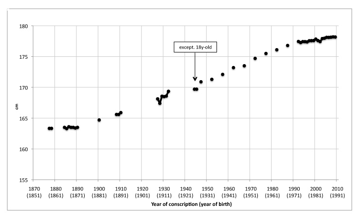

```{r setup, include=FALSE}
options(htmltools.dir.version = FALSE)
library(tidyverse)
theme_set(theme_bw())

knitr::opts_chunk$set(
  tidy = TRUE, 
  echo = FALSE
)

```

<!------- emoji `r emo::ji("open_mouth")`---------->
<!------- icons `r icon::fa_r_project(colour = "#88398a")`---------->
<!------- icons `r icon::ii_heart()` ---------->


---
class: inverse, left, middle

# Outline

- Introduction (= explaining the title)

- Results ( = what I did during the PhD)

- Discussion (= did it work? & whats now)

<!---------------- INTRODUCTION --------------->
---
class: inverse, center, middle

# Introduction


<!---- Data analysis -------->
---
class: center, middle

## 1. What is data analysis?

---
class: left, middle

### Example: Distribution of human height

```{r, fig.width = 6, fig.height = 3}

set.seed(3)
height <- rnorm(100, 164, sd = 8)
av <- mean(height)
dat <- data.frame(Height = height, y= 1)
ggplot(data = NULL) + geom_point(aes(Height, y), data = dat, alpha = I(0.7)) + ggtitle("Human height.") +  theme(axis.title.y=element_blank(), axis.text.y=element_blank(), axis.ticks.y=element_blank()) + ylim(c(0.95, 1.05))

```

.footnote[From https://en.wikipedia.org/wiki/List_of_average_human_height_worldwide#cite_note-Staub-134. ]


---
class: left, middle

### Example: Distribution of human height

```{r, fig.width = 6, fig.height = 3}

set.seed(3)
height <- rnorm(100, 164, sd = 8)
av <- mean(height)
dat <- data.frame(Height = height, y= 1)
ggplot(data = NULL) + geom_point(aes(Height, y), data = dat, alpha = I(0.7)) + ggtitle("Human height.") + geom_point(aes(x = av, y = 1), color = I("red"), size = I(3)) +  theme(axis.title.y=element_blank(), axis.text.y=element_blank(), axis.ticks.y=element_blank()) + geom_text(aes(x = av, y= 1.01, label = "Average"), color = I("red")) + ylim(c(0.95, 1.05))

```

.footnote[From https://en.wikipedia.org/wiki/List_of_average_human_height_worldwide#cite_note-Staub-134. ]

---
class: left, middle

### Example: Distribution of human height over time



.small[Evolution of the average height (cm) of 19-year-old Swiss conscripts from 1878–79 to 2009 (1992–2009: individual data, before 1992: published averages). ]

.footnote[From https://smw.ch/article/doi/smw.2011.13238. ]


---
class: left, middle

### Example: Relationship of bodysize and brain


.small[Brain–body mass ratio relationship for mammals. ]

.footnote[From https://en.wikipedia.org/wiki/Brain-to-body_mass_ratio. ]

---
class: left, middle

## What is the purpose of data analysis?

1. `r icon::fa_caret_down()` Distill knowledge from data: *Average height in Swiss women in 2017.*

1. `r icon::fa_chart_line()` quantify relationships: *Evolution of human height over time, relationship between height and ..* 

1. Statistical methods / tools help us to understand the world (= complex systems) we life in 

1. How it works: have a question, collect data, answer the question, limited to the data. 

---
class: left, middle

## Other examples of data analysis usage

- e.g. prediction of temperature rise
- score for born baby (Apgar score)
- e.g. score for disease: diagnosis


---
class: left, middle

## Central principles of data analysis

- Data that we have is often time a proxy for something we would like to measure, but cannot (*for example: we use BMI as a proxy for obesity*)

- The more data we have, the *more precise* we can quantify something (= sqrt(N) correlates with standard error)

- Some things are more difficult to measure than other things
  - a relationship between X and Y is easier to quantify than showing that X is causing Y: * Correlation != Cause*.
  - it is impossible to *prove* something, but we can give evidence that something is more likely: *= Hypothesis testing*.

---
class: left, middle

## Keep in mind `r icon::fa_hand_pointer()`

- Linear regression
- Sample size

<!---- Biology -------->

---
class: center, middle

## 2. Bits of biology 

or: what is *-omics*?

---
class: left, middle

## DNA as the blueprint of life

- we are originally just one cell with dna from mum and dna from dad

- DNA cnanot be changed easily

- A, C, G, T: SNP

- SNPs of famuous ppl

- LD, gummy bears

---
class: left, middle

## Layers

- RNA, ... 


- basket of environment


---
class: left, middle

## Why are we interesed in DNA? 

- disecting genetic from environmental effects

- knowing risk per person to develop a disease


---
class: left, middle

## How is DNA measures?


---
class: left, middle

## Keep in mind `r icon::fa_hand_pointer()`

- DNA cannot be changed
- LD
- SNP

<!---- GWAS  -------->
<!--- combine DA and biology -------->
---
class: center, middle

## 3. GWAS (genome-wide association study)

---
class: left, middle

## Relationship between DNA and trait/disease

> Illustration

---
class: left, middle

## Relationship between DNA and trait/disease

> Illustration of 1 SNP

> Manhatten plot


---
class: left, middle

## TOP SNPs in height

- Increase height by... cm
- Top player basketball

---
class: left, middle

## Large sample sizes needed


- Solution \#1: exploit LD and use cheap chips instead of pricy sequencing

- Solution \#2: Build consortium

---
class: left, middle

## How GWASs work 

- Large sample sizes needed > consortium

- Meta analsysis

- Make results public

---
class: left, middle

## Example GWAS

of a latest paper

---
class: left, middle

## Keep in mind `r icon::fa_hand_pointer()`

- Large sample sizes required: consortium!

- Recycling GWAS summary stats for other methods


<!---- Missing data -------->
---
class: center, middle

## 4. Missing data

---
class: left, middle

## Analogy

- How to infer data that is missing

- Analogy: Hiking Map

---
class: left, middle

## Basic principle


<!---- SSIMP -------->
---
class: center, middle

## 3. Summary statistic imputation (SSIMP)

---
class: left, middle

## How SSimp works


<!---------------- RESULTS --------------->
---
class: inverse, center, middle

# Results

<!---- SSIMP - plosgen -------->

rueeger-etal-2018-fp.pdf

<!---------------- DISCUSSION --------------->

---
class: inverse, center, middle

# Discussion

---
class: left, middle

## My contribution

With my work on summary statistic imputation I have helped to im- prove linking incomplete GWAS summary statistics with follow-up methods.

- SSIMP: Bridging GWAS summary statistics with follow up methods
- Improving SSIMP (improved imputation quality and optimised assembly of the LD matrix)
- Quantified how well SSIMP works (compared to genotype imputation, identified groups of genetic variants that are hard to impute, and demonstrated in a case study the util- ity of summary statistic imputation). 


---
class: left, middle

## What needs to be improved for SSIMP

- LD matrix estimation
- how to incorporate SSIMP into cohort pipeline
- maintaining software


---
class: left, middle

## What is needed for GWASs

Foundation of SSIMP 

- Quality of GWAS
- More -omics data / deep phenotyinging
- Mutliethnic GWASs
- Public data: 
- Large & diverse reference panels