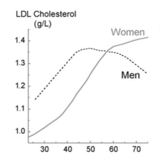
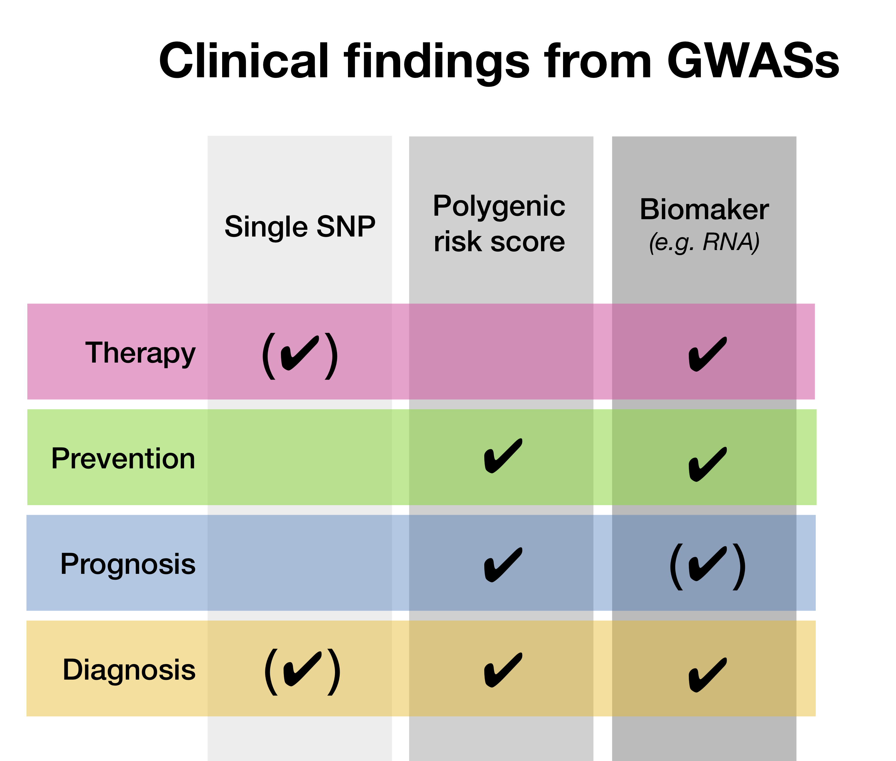
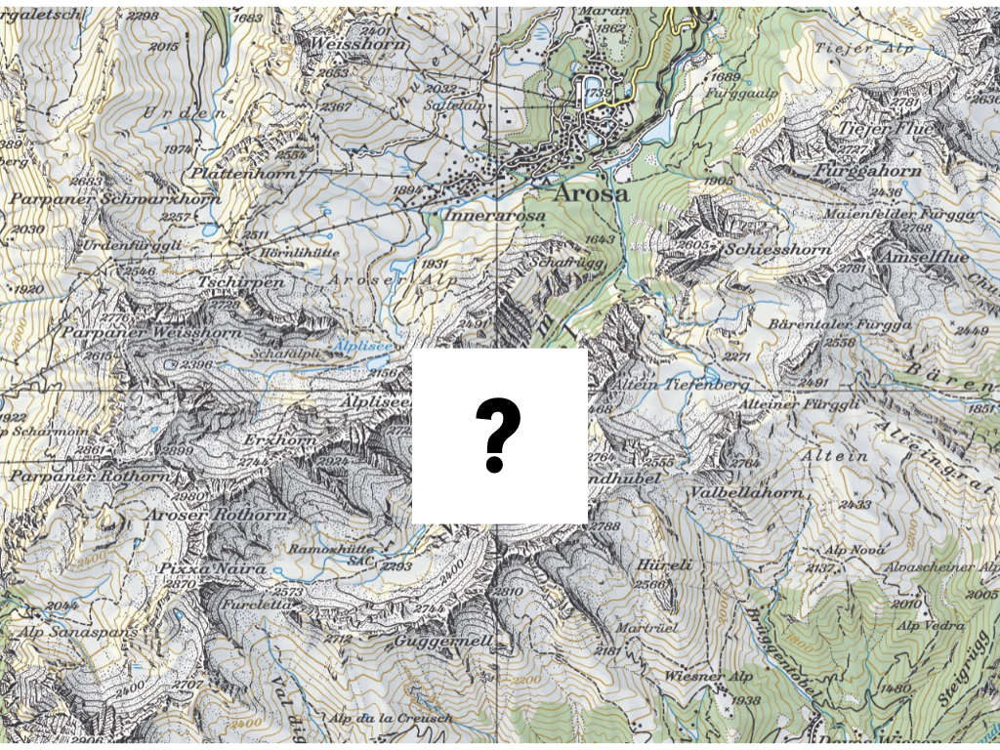
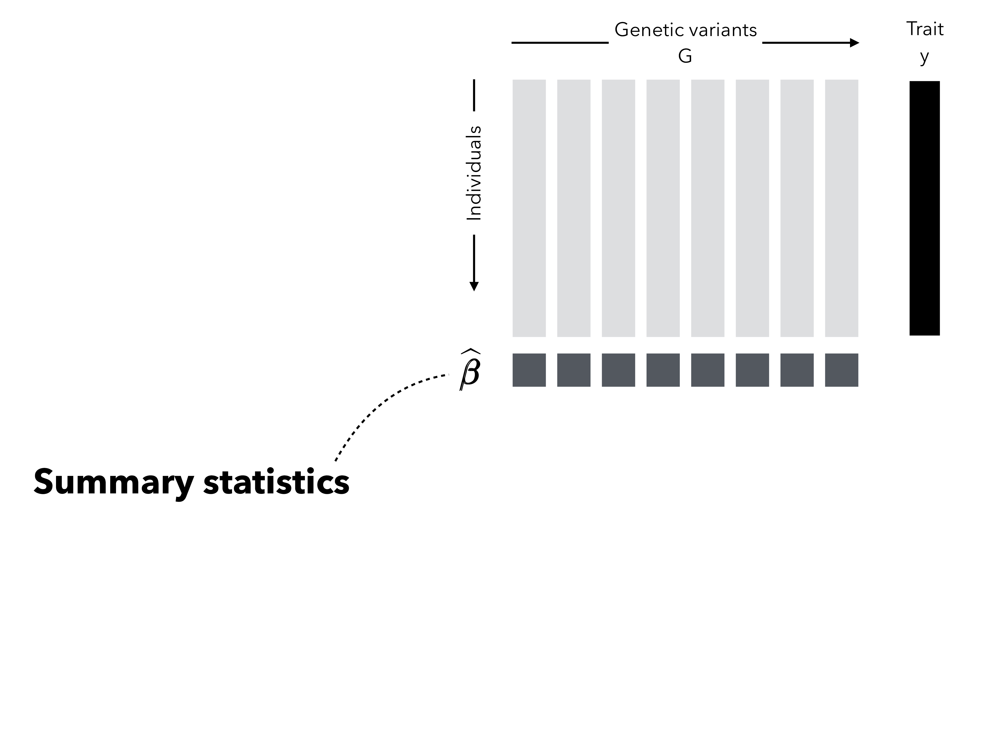
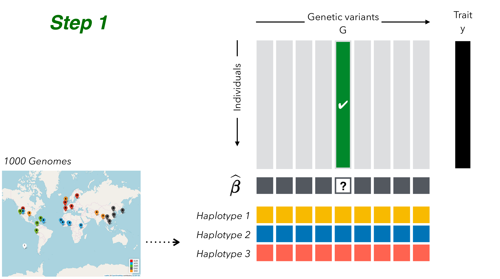

```{r setup, include=FALSE}
options(htmltools.dir.version = FALSE)
library(tidyverse)
theme_set(theme_bw())

knitr::opts_chunk$set(
  tidy = TRUE, 
  echo = FALSE
)

```

<!------- emoji `r emo::ji("open_mouth")`---------->
<!------- icons `r icon::fa_r_project(colour = "#88398a")`---------->
<!------- icons `r icon::ii_heart()` ---------->


---
class: inverse, left, middle

# Outline

- Introduction

- Results

- Discussion 

---
class: inverse, left, middle

# Outline

- Introduction (= explaining the title)

- Results (= what I did during the PhD)

- Discussion (= did it work? & outlook)


<!---------------- INTRODUCTION --------------->
---
class: inverse, center, middle

# Introduction

---
class: center, middle

## The goals to keep in mind: *Cornerstones of Medicine*


<!---- Data analysis -------->
---
class: center, middle

## 1. What is "data analysis" and "statistics"?

---
class: left, middle

### Summarise data

#### Example: Distribution of human height in 100 individuals

```{r, fig.width = 6, fig.height = 3, dev = "pdf"}

set.seed(3)
height <- rnorm(100, 164, sd = 8)
av <- mean(height)
dat <- data.frame(Height = height, y= 1)
ggplot(data = NULL) + geom_point(aes(Height, y), data = dat, size = I(3), shape = 1) + ggtitle("Human height.") +  theme(axis.title.y=element_blank(), axis.text.y=element_blank(), axis.ticks.y=element_blank()) + ylim(c(0.95, 1.05))

```


---
class: left, middle

### Summarise data

#### Example: Distribution of human height in 100 individuals

```{r, fig.width = 6, fig.height = 3}

set.seed(3)
height <- rnorm(100, 164, sd = 8)
av <- mean(height)
dat <- data.frame(Height = height, y= 1)
ggplot(data = NULL) + geom_point(aes(Height, y), data = dat, size = I(3), shape = 1) + ggtitle("Human height.") + geom_point(aes(x = av, y = 1), color = I("red"), size = I(3)) +  theme(axis.title.y=element_blank(), axis.text.y=element_blank(), axis.ticks.y=element_blank()) + geom_text(aes(x = av, y= 1.01, label = "Average"), color = I("red")) + ylim(c(0.95, 1.05))

```


---
class: left, middle

### Identify relationships between A and B

#### Example: Relationship between age, sex and LDL (low-density lipoprotein)

.small[From: Freedman et al. (2004)]

 <!-----  ------->


---
class: left, middle

### Identifying patterns

#### Example: Genes mirror geography within Europe


.small[From: Novembre et al. (2008)]


---
class: left, middle

### Medical scores to assess patients

#### Example: APGAR score

Test done in newborns 1-5 minutes after birth. 

1. Skin color
2. Pulse rate
3. Reflex
4. Activity
5. Respiratory


.small[From: Apgar (1953)]


---
class: left, middle

## What is the purpose of statistical methods? `r icon::fa_chart_line()`

1. By summarising data we can `r icon::fa_caret_down()` distill knowledge.

1. Helps us to understand the world and the complex systems we life in.

1. How data analysis works: 
    - identify a problem
    - define a question
    - collect data
    - answer the question (limited to the data used)


---
class: left, middle

## Central principles of data analysis

- Data represents oftentimes an **approximation** for something we cannot measure `r icon::fa_arrow_right()` *Use of BMI as a proxy for obesity*.

- The more data records we have, the **more precise** the estimation (of interest) `r icon::fa_arrow_right()` *Relationship between sample size and the standard error*.

- Some questions are harder to answer than others: 
  - a **relationship between X and Y** is easier to quantify than showing that X is causing Y `r icon::fa_arrow_right()` * Correlation ≠ Causation*.
  - it is **impossible to prove** a hypothesis, but we can reject a hypothesis `r icon::fa_arrow_right()` *aka hypothesis testing*.

---
class: left, middle

## Keep in mind `r icon::fa_hand_pointer()`

- Statistical methods: summarise data & quantify relationships.

- Increasing sample size helps to estimate precisely. 

<!---- Biology -------->

---
class: center, middle

## 2. Bits of biology 

or: what is *-omics*?

---
class: left, middle

## DNA is the blueprint of human life

- we are originally just one cell with dna from mum and dna from dad

- DNA cnanot be changed easily

- A, C, G, T: SNP

- SNPs of famuous ppl

- LD, gummy bears

- complex traits: many genes are affecting... 

---
class: left, middle

## Layers

- RNA, ... 


- basket of environment


---
class: left, middle

## Why are we interesed in DNA? 

- disecting genetic from environmental effects

- knowing risk per person to develop a disease




---
class: left, middle

## How is DNA measures?


---
class: left, middle

## Keep in mind `r icon::fa_hand_pointer()`

- DNA cannot be changed
- LD
- SNP

<!---- GWAS  -------->
<!--- combine DA and biology -------->
---
class: center, middle

## 3. GWAS (genome-wide association study)

---
class: left, middle

## Relationship between a genotype and trait/disease

```{r, fig.width = 6, fig.height = 6, dev="pdf"}

set.seed(3)
gt.0 <- 100
gt.1 <- 100
gt.2 <- 100
A <- 50 ##intercept
B <- 2  ## slope
dat <- data.frame(genotype = c(rep(0, gt.0), rep(1, gt.1), rep(2, gt.2)))
dat$disease <- A + dat$genotype * B + rnorm(nrow(dat))

ggplot(data = dat) + geom_point(aes(x = genotype, y = disease))+ geom_boxplot(aes(x = genotype, y = disease, group = genotype))

```

---
class: left, middle

## Relationship between a genotype and trait/disease

```{r, fig.width = 6, fig.height = 6, dev="pdf"}

ggplot(data = dat) + geom_point(aes(x = genotype, y = disease))+ geom_boxplot(aes(x = genotype, y = disease, group = genotype)) + geom_abline(aes(intercept = A, slope = B), color = I("red"))

```

---
class: left, middle

## Relationship between a genotype and trait/disease


---
class: left, middle

## Relationship between MANY genotypes and trait/disease


---
class: left, middle

## TOP SNPs in height

- Increase height by... cm
- Top player basketball

---
class: left, middle

## Large sample sizes needed


- Solution \#1: exploit LD and use cheap chips instead of pricy sequencing

- Solution \#2: Build consortium


---
class: left, middle

## GWAS summary statistics


---
class: left, middle

## Example GWAS

of a latest paper

---
class: left, middle

## Keep in mind `r icon::fa_hand_pointer()`

- Large sample sizes needed: consortium!

- Recycling GWAS summary statistics with other methods. 


<!---- Missing data -------->
---
class: center, middle

## 4. Missing data

---
class: left, middle

## How to infer data that is missing?




---
class: left, middle

## How to infer data that is missing?


---
class: left, middle

## Basic principle


---
class: left, middle

## Public reference panel


<!---- SSIMP -------->
---
class: center, middle

## 3. Summary statistic imputation (SSIMP)

---
class: left, middle

## GWAS



---
class: left, middle
## Untyped variant


---
class: left, middle

## Genotype imputation



---
class: left, middle

## Genotype imputation


---
class: left, middle

## Summary statistic imputation


---
class: left, middle

## Main equation


<!---------------- RESULTS --------------->
---
class: inverse, center, middle

# Results


---
class: left, middle
# Output


1. `r icon::fa_arrow_right()` Evaluation and application of summary statistic imputation `r icon::fa_arrow_left()`
    - <small>*Evaluation and application of summary statistic imputation to discover new height- associated loci*  (Rüeger, McDaid, and Kutalik 2018)</small>

1. Improving summary statistic imputation for mixed populations
    - <small>*Improved imputation of summary statistics for mixed populations*  (Rüeger, McDaid, and Kutalik 2017, not peer-reviewed)</small>

1. Applications of summary statistic imputation
    - <small>*Rare and low-frequency coding variants alter human adult height* (Marouli et al. 2017)</small>
    - <small>*Bayesian association scan reveals loci associated with human lifespan and linked biomarkers* (McDaid et al. 2017)</small>

1. Contributions to research in infectious diseases
    - <small>*Impact of com- mon risk factors of fibrosis progression in chronic hepatitis C* (Rüeger et al. 2015)</small>
    - ...

1. Minor contributions to other publications

---
class: left, middle


---
class: left, middle

# Goals

1. Improve imputation quality & investigate parameters of SSIMP.

1. Compare summary statistic imputation to genotype imputation.

1. Test the utility of summary statistic imputation on a real case on human height data.


---
class: left, middle

# How to test new methods?
--

.pull-left[
.big[`r emo::ji("see_no_evil")`]
]

.pull-right[
1. Pretend to not have seen recent results for new set of markers (obtained through sequencing, genotyping or genotype imputation).  

1. Apply SSIMP.

1. Compare SSIMP-results to results by traditional methods. 
]

---
class: left, middle

# 2. Compare SSIMP to genotype imputation


---
class: left, middle


---
class: left, middle


---
class: left, middle

# 3. Test SSIMP on height GWAS


---
class: left, middle


## Locuszoom plot of results


---
class: left, middle


## Comparing imputation results to exome results


<!---------------- DISCUSSION --------------->

---
class: inverse, center, middle

# Discussion


---
class: left, middle

## Outlook for SSIMP

To impute summary statistics reliably the following is needed `r emo::ji("point_up")`

```{r}
icon.world <- purrr::map_chr(RColorBrewer::brewer.pal(5, "Set1"), ~icon::fa_globe(color = .))
```

### `r icon.world[1]` `r icon.world[2]` `r icon.world[3]` `r icon.world[4]` `r icon.world[5]` Large and diverse reference panels 

- to improve of LD matrix estimation
- to impute low-frequency variants 
- to impute cosmopolitan/mutliethnic GWASs

### `r icon::fa_wrench(color = "gray")` Software & tooling 

- easy to use and maintained

### `r icon::ii_ios_cloud_download()` Publicly available GWAS data  

- the foundation of SSIMP


---
class: left, middle

## Conclusion `r icon::fa_pagelines(color = "green")`

With my work on summary statistic imputation I have helped to **link incomplete GWAS** summary statistics with **follow-up methods** (such as multi-trait analyses).


- **Improved SSIMP**: .small[improved imputation quality and optimised assembly of the LD matrix.]

- Quantified **performance of SSIMP**: .small[compared to genotype imputation, identified groups of genetic variants that are hard to impute, and demonstrated in a case study the utility of summary statistic imputation.] 

---
class: inverse, center, middle

.big[<font face="Yanone Kaffeesatz"> Thank you! </font>] <!------`r icon::fa_smile()` ---------->

Slides: [https://sinarueeger.github.io/publicdefense/slides#1](https://sinarueeger.github.io/publicdefense/slides#1)

Source code: [https://github.com/sinarueeger/publicdefense/](https://github.com/sinarueeger/publicdefense/)

